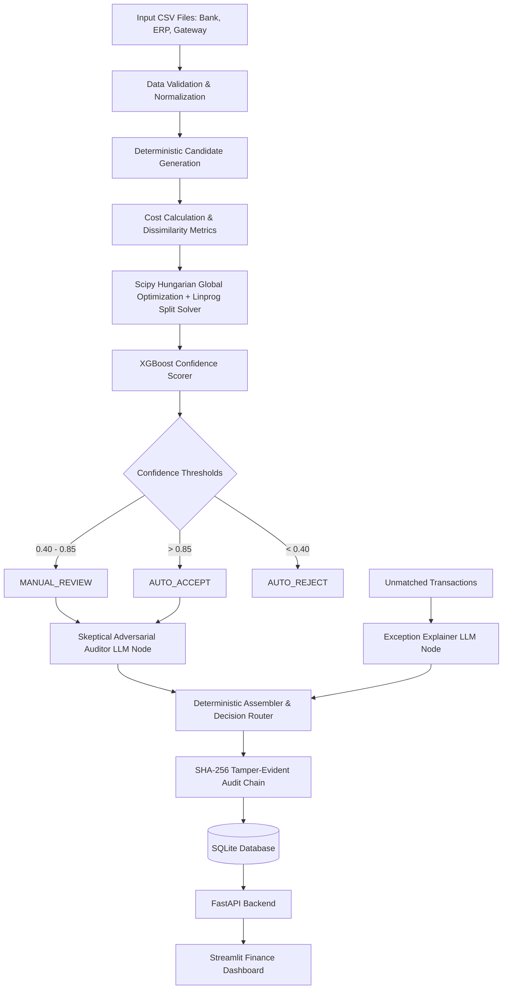

# Razorpay AI Finance Controller

🚀 **Live Demo**: [https://finsyn.streamlit.app/](https://finsyn.streamlit.app/)

An autonomous, multi-ledger financial reconciliation system built around a strict core principle:

> **PYTHON + OPTIMIZATION + ML MAKE ALL MATCHING DECISIONS. LLMs DO NOT DECIDE WHETHER TRANSACTIONS MATCH.**

---

## Architecture Diagram



---

## Why Financial Reconciliation is Difficult

Financial ledgers (ERP invoices, Bank statements, Razorpay gateway settlements) contain real-world inconsistencies:
- **Amount rounding & FX differences**: Payment gateway fees (1.5–2.5%) or currency conversion noise.
- **Timing Lags**: Settlements occur T+1, T+2, or T+3 days after payment creation.
- **Reference ID Mismatches**: ERP records `INV-00102`, Bank statement records `RZRPY-X9Y8Z7`.
- **Split & Merged Payments**: 1 ERP invoice paid via 2 bank installments, or batch settlements.
- **Missing Records**: Voided transactions, chargebacks, or pending bank deposits.

---

## Why Separation of Concerns Matters (Non-Negotiable Architecture)

1. **Scipy Hungarian Algorithm (`linear_sum_assignment`)**: Globally optimizes transaction assignments across ledgers instead of using greedy matching, preventing cascading errors.
2. **`scipy.optimize.linprog`**: Solves 1-to-many (split) and many-to-1 (merged) transportation problems.
3. **XGBoost Confidence Scorer**: Learned probability scores using 8 deterministic signal features.
4. **LLMs (LangChain/LangGraph)**:
   - **Exception Explainer**: Analyzes unmatched records and categorizes root causes.
   - **Adversarial Auditor**: Acts as a skeptical reviewer looking for red flags (round amounts, missing IDs, suspicious coincidences). **Does NOT make match decisions directly.**
5. **SHA-256 Hash Chain**: Cryptographically links every reconciliation decision block with `previous_hash` and `this_hash` for tamper verification.

---

## Project Structure

```
FinSyn/
├── app/ -> (see api & matcher)
├── agents/
│   ├── graph.py        # LangGraph state graph compilation
│   └── nodes.py        # Exception Explainer & Skeptical Auditor nodes
├── api/
│   └── main.py         # FastAPI application endpoints
├── audit/
│   └── hash_chain.py   # SHA-256 tamper-evident audit chain
├── data/
│   ├── synthetic/      # Generated demo CSVs & ground_truth.json
│   └── xgboost_model.pkl
├── db/
│   ├── models.py       # SQLAlchemy ORM models
│   └── database.py     # SQLite session manager
├── frontend/
│   └── streamlit_app.py # Interactive Streamlit dashboard
├── generator/
│   └── synthetic.py    # Multi-scenario synthetic dataset generator
├── matcher/
│   ├── engine.py       # Candidate generation & column normalization
│   ├── features.py     # 8 target feature extraction & ground truth labeling
│   ├── hungarian.py    # Global assignment solver & ground truth evaluation
│   ├── pipeline.py     # Complete reconciliation pipeline orchestrator
│   ├── scorer.py       # XGBoost classifier & PR curve evaluator
│   └── split_merge.py  # Linprog transportation solver for split/merged rows
├── tests/
│   ├── test_reconciliation.py # 17 comprehensive unit & integration tests
│   └── run_tests.py    # Standalone test runner
├── .env.example
├── Dockerfile
├── render.yaml
├── requirements.txt
└── test_pipeline.py    # End-to-end pipeline verification script
```

---

## Local Setup

### 1. Clone & Setup Virtual Environment
```bash
python -m venv venv
# On Windows:
.\venv\Scripts\activate
# On Linux/macOS:
source venv/bin/activate
```

### 2. Install Dependencies
```bash
pip install -r requirements.txt
```

### 3. Environment Variables
Copy `.env.example` to `.env`:
```env
GROQ_API_KEY=gsk_your_groq_api_key_here
LLM_MODEL=llama-3.3-70b-specdec
DATABASE_URL=sqlite:///data/reconciliation.db
CONFIDENCE_HIGH=0.85
CONFIDENCE_LOW=0.40
```

---

## How to Run

### 1. Run Unit & Integration Test Suite (17 Tests)
```bash
python tests/run_tests.py
```

### 2. Run End-to-End Pipeline Verification Script
```bash
python test_pipeline.py
```

### 3. Launch Streamlit Finance Dashboard
```bash
streamlit run frontend/streamlit_app.py
```
Open browser at `http://localhost:8501`.

### 4. Launch FastAPI Server
```bash
uvicorn api.main:app --reload --port 8000
```
API Documentation available at `http://localhost:8000/docs`.

---

## API Endpoints

- `GET /health`: Health check endpoint.
- `POST /reconcile`: Accepts `erp_file` (CSV), `bank_file` (CSV), and optional `gateway_file` (CSV). Returns run summary, match decisions, exceptions, SHA-256 verification, and evaluation metrics.
- `POST /demo/generate`: Generates synthetic datasets with ground truth for demo testing.

---

## Deployment Instructions

### Render Deployment
This project includes `render.yaml` for 1-click deployment to Render:
- **Build Command**: `pip install -r requirements.txt`
- **Start Command (API)**: `uvicorn api.main:app --host 0.0.0.0 --port $PORT`
- **Start Command (Dashboard)**: `streamlit run frontend/streamlit_app.py --server.port $PORT --server.address 0.0.0.0`

### Streamlit Community Cloud
Set entry point to `frontend/streamlit_app.py` and configure `GROQ_API_KEY` under Secrets.
